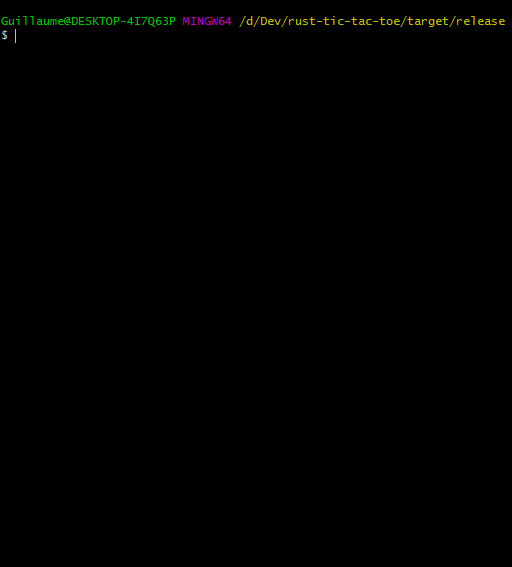

# Tic-tac-toe with Rust
Spend your time wisely playing tic-tac-toe with up to 26 players! Don't ask how all of them are going to fit the grid.

## How to play
Run `./tic-tac-toe.exe --help` to discover the command line arguments available.

You don't feel like running the program on your machine? Here is what it looks like:

* against one computer,
* against a friend (two players on the same machine),
* two computers against each other.

## What could we improve?
The game would be even better with:

* Choosing the size of the grid, ie 5x5, 7x7.
* Multiplayer mode.
* Distribute an executable.
* A graphical user interface.
